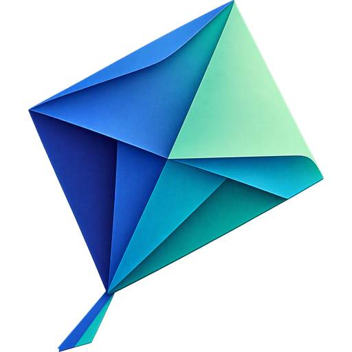

  

<h1 align="center">LetKite</h1>

  <a href="https://github.com/letkite/.github/blob/main/profile/README.md">English</a> · <a href="https://github.com/letkite/.github/blob/main/profile/docs/README.zh.md">简体中文</a> · <b>日本語</b> · <a href="https://github.com/letkite/.github/blob/main/profile/docs/README.ko.md">한국어</a> · <a href="https://github.com/letkite/.github/blob/main/profile/docs/README.es.md">Español</a> · <a href="https://github.com/letkite/.github/blob/main/profile/docs/README.fr.md">Français</a> · <a href="https://github.com/letkite/.github/blob/main/profile/docs/README.de.md">Deutsch</a>

**LetKite は、AI とあなたのマシンをつなぐ実行レイヤーです。** ロボットが AI に物理世界での手を与えるように、LetKite は AI にデジタル世界での手を与えます。LetKite はリモート MCP ゲートウェイであり、Claude をはじめとする MCP 対応の AI アシスタントが、サーバー、工場設備、スマートホーム機器からなるフリート全体でコマンドの実行、ファイルの管理、ログの追跡を行えるようにします。すでにご利用中の AI プランにカスタムコネクタとして一度追加するだけで、すべての操作は権限によって管理され、重要な操作には承認が求められ、監査のために記録されます。まずは無料のオープンソース版 [LetKite Lite](https://github.com/letkite/letkite-lite) から始めるか、[letkite.com](https://letkite.com) で詳細をご覧ください。
